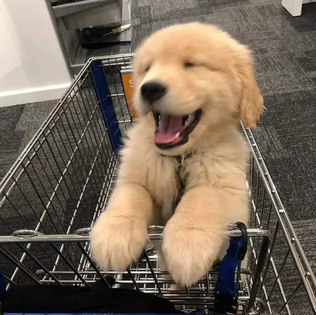
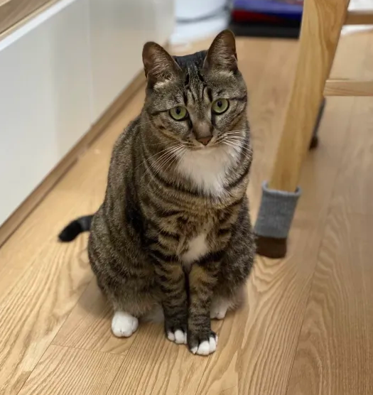
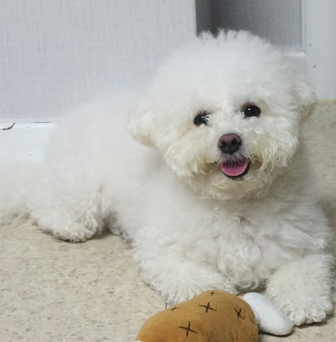
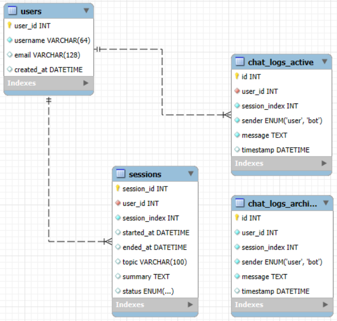
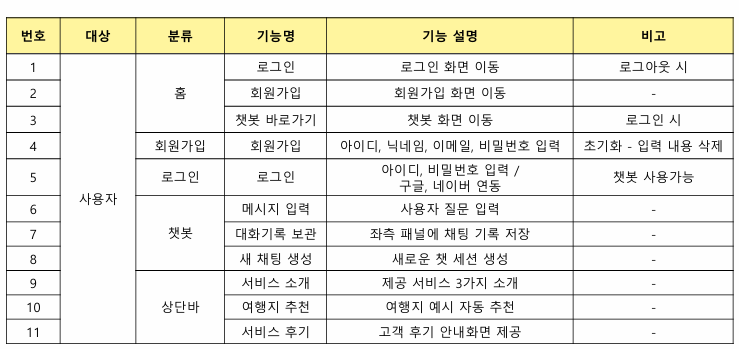

# SKN12-4th-1TEAM
 
skn12기 3차 프로젝트 1팀

# 🐾 우리 개 어디가? - 반려동물 동반 여행 가이드 챗봇

> **조 이름:** 집사들  
> **주제:** 반려동물 동반 여행 가이드 챗봇  
> **앱 이름:** _우리 개 어디가?_

## 👨‍👩‍👧‍👦 조원 명단

| 김승학                  | 박슬기                  | 이용규               | 이주영                  | 조성지                   |
| ----------------------- | ----------------------- | -------------------- | ----------------------- | ------------------------ |
|     |     |  |     |      |
| 풀스택, 배포 | 백엔드 | 백엔드 | 프론트엔드 | 프론트엔드 |

---

## 🧠 시스템 아키텍처

---

## 🐶 DB 구조

---

## 🍀 요구사항 정의서

---

## 💬 팀원 한 줄 회고

| 이름   | 한 줄 회고                                                                                                                                    |
| ------ | --------------------------------------------------------------------------------------------------------------------------------------------- |
| 김승학 | LLM을 AWS에 배포하니 확장성과 안정성이 확보되지만 그만큼 과정이 엄청 힘들었다.                                       |
| 박슬기 | 좋은 팀원들 덕분에 협업하여 좋은 결과물을 낼 수 있었다. DB 구조 설계를 진행하고 실제 배포가 되는 모습이 신기하면서도 재밌었다.                  |
| 이용규 | llm, 백엔드, 데이터베이스의 구조를 이번 프로젝트를 통해 한단계더 깊게 이해할수 있었던것 같다.      |
| 이주영 | 아           |
| 조성지 | 똑똑하고 멋있는 팀원들 덕분에 수업시간에 배운 것을 어떻게 활용할 수 있는지 경험해볼 수 있어 좋았다. |

---
